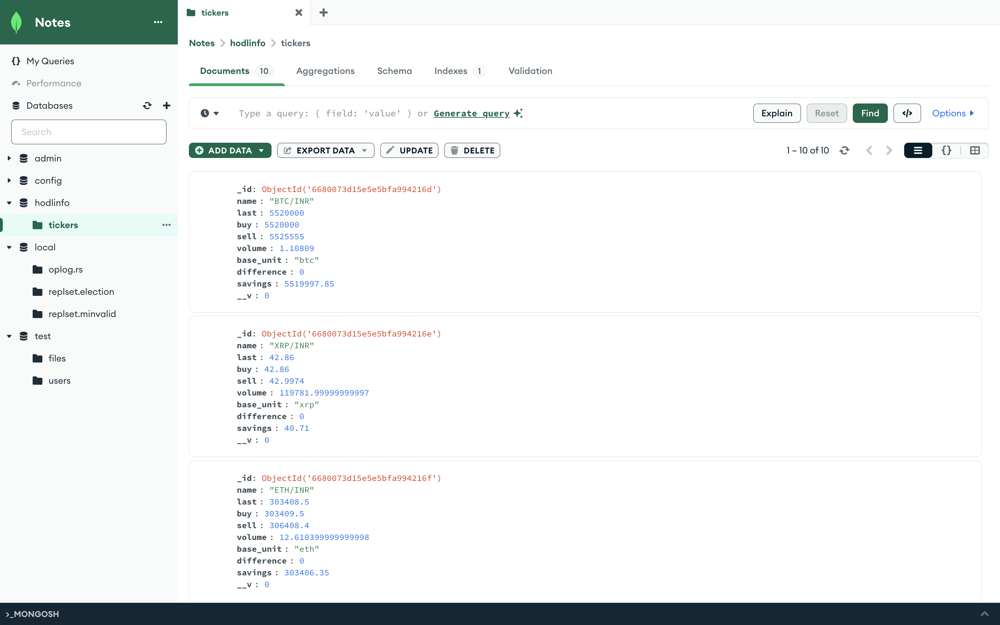

# Hodlinfo

Diployed Link: https://hodlinfo-b67i.onrender.com

## Overview

Hodlinfo is a web application that fetches cryptocurrency ticker data from the WazirX API and displays it in a user-friendly interface. The data is stored in a MongoDB database and updated every 5 minutes.

## Features

- Fetches top 10 cryptocurrency tickers from WazirX API.
- Stores ticker data in MongoDB.
- Displays ticker data in a tabular format.
- Light and dark mode themes.
- Auto-refreshes the page every 60 seconds.

## MongoDB Schema

## Installation

### Prerequisites

- Node.js (v12 or higher)
- MongoDB

### Steps

1. **Clone the repository:**

2. **Install dependencies:**

3. **Set up MongoDB:**
    - Ensure MongoDB is running.
    - Update the MongoDB connection string in `app.js` if necessary.

4. **Run the application:**

5. **Open your browser and navigate to:**

## Usage

- The application will fetch and display the top 10 cryptocurrency tickers.
- The data is updated every 5 minutes.
- The page auto-refreshes every 60 seconds to display the latest data.

## Screenshots

### Main Interface

### MongoDB Schema

## Contributing

1. Fork the repository.
2. Create a new branch (`git checkout -b feature-branch`).
3. Make your changes.
4. Commit your changes (`git commit -m 'Add some feature'`).
5. Push to the branch (`git push origin feature-branch`).
6. Open a pull request.

## License

This project is licensed under the MIT License - see the [LICENSE](LICENSE) file for details.

## Acknowledgements

- [Express](https://expressjs.com/)
- [Mongoose](https://mongoosejs.com/)
- [Axios](https://axios-http.com/)
- [EJS](https://ejs.co/)
- [WazirX API](https://wazirx.com/)

